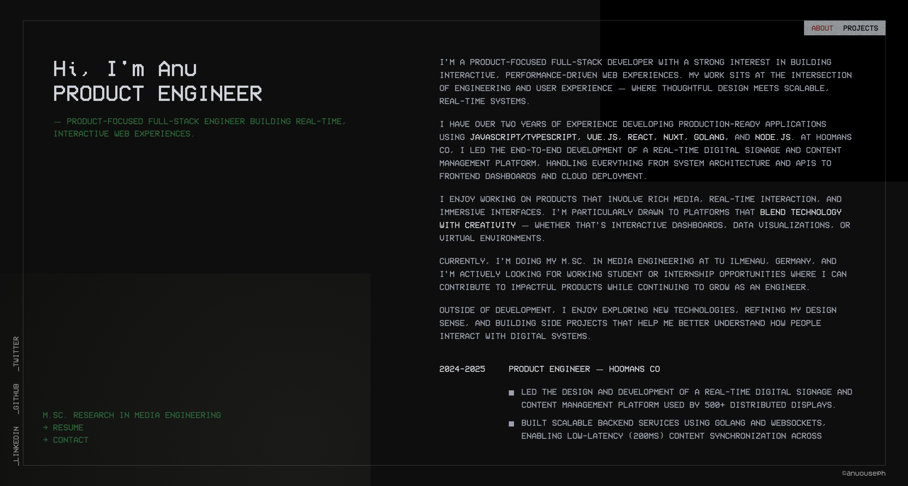
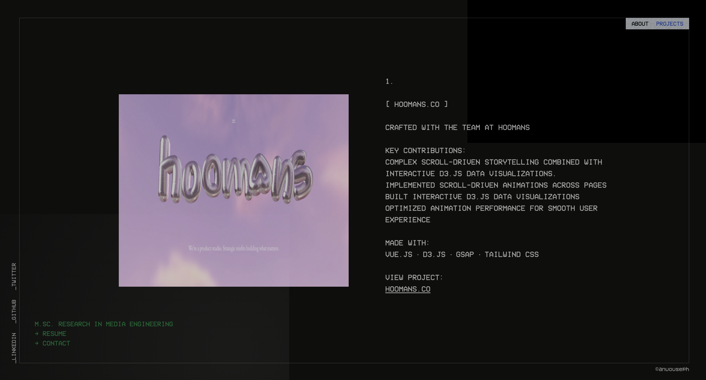

# anu ouseph — portfolio

> Interactive portfolio built with custom GLSL shaders, scroll-driven animations, and immersive 3D visuals.




**[anuouseph.vercel.app](https://anuouseph.vercel.app)**


## What's inside

A personal portfolio that goes beyond a static page. Every interaction is intentional — from the shader-driven project gallery to the scroll-triggered transitions. Built to reflect the kind of frontend work I care about: interfaces that feel alive.

**Key details:**
- Custom GLSL shaders for mouse-driven image distortion and chromatic aberration effects
- Scroll-driven animations tied directly to scroll position, not triggered on a delay
- 3D project gallery using Three.js with optimized rendering for smooth performance on mid-range devices
- Terminal-style typography and dark aesthetic built entirely with Tailwind CSS

---

## Built with

| Layer | Tech |
|---|---|
| Framework | Vue.js |
| 3D / Shaders | Three.js · GLSL |
| Animation | GSAP · ScrollTrigger |
| Styling | Tailwind CSS |
| Deployment | Vercel |

---

## Running locally

```bash
git clone https://github.com/AnuOuseph/Portfolio_AnuOuseph
cd Portfolio_AnuOuseph
npm install
npm run dev
```

---

## About me

Full-stack developer focused on real-time and interactive interfaces. Currently doing M.Sc. in Media Engineering at TU Ilmenau, Germany. Previously built production systems at Hoomans.co including a real-time digital signage platform running on 500+ distributed displays.

[LinkedIn](https://linkedin.com/in/anuouseph) · [GitHub](https://github.com/AnuOuseph) · [Email](mailto:anuouseph04@gmail.com)

## Author

**Anu Ouseph**  
Full-stack developer| Interactive UI | Creative Coding
